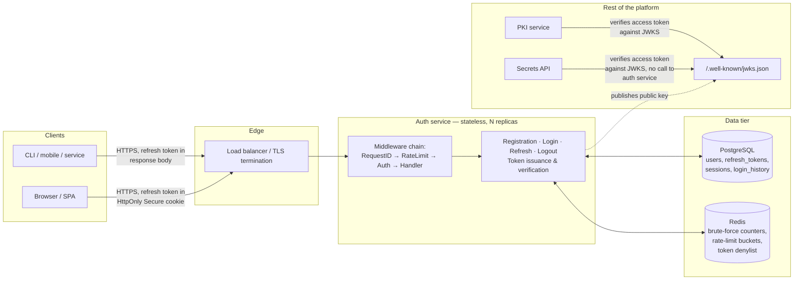
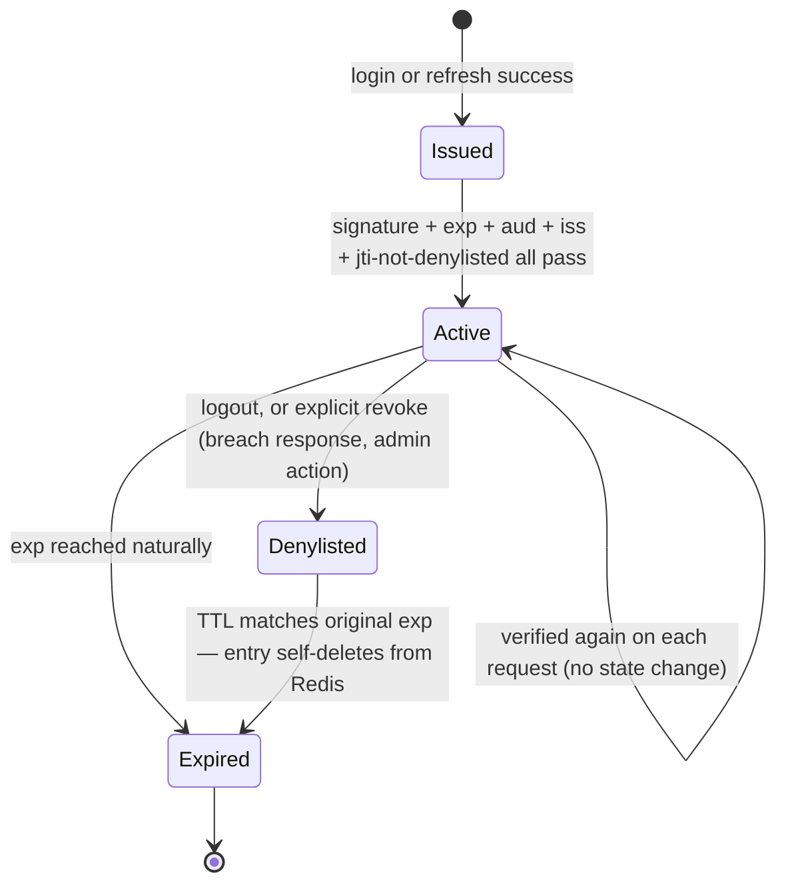
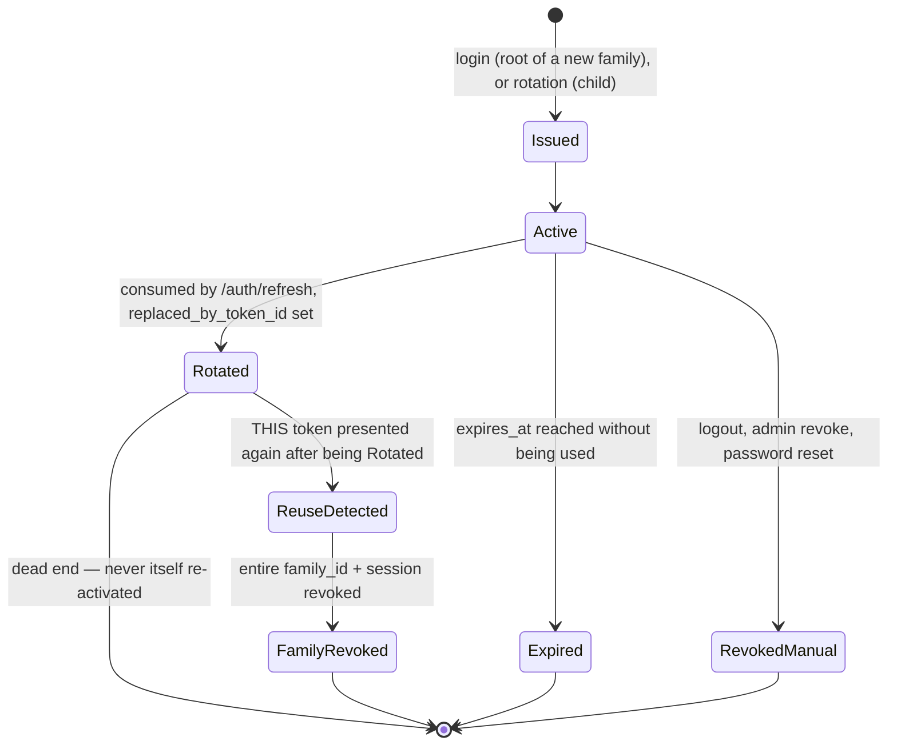

# Secrets Management Platform — Authentication Architecture (Sprint 2)

**Status:** Design only — no application code in this sprint. This document is the contract Sprint 3's implementation is written against, in the same spirit as `auth-service-database-schema.md` and `auth-service-api-design.md` from Sprint 1.

**Stack:** Go (auth service, stateless, horizontally scaled) · PostgreSQL (durable source of truth) · Redis (fast, ephemeral security-hot-path state) · REST over TLS.

**Scope:** registration, password hashing, login, short-lived access tokens, refresh tokens, session management, logout, token revocation, authentication middleware, brute-force protection. Email verification, MFA, and SSO are named as extension points where a decision affects this sprint's schema, but are not designed in full here — they're Sprint 3+/4 scope, called out explicitly rather than silently assumed.

---

## 1. Authentication architecture

### 1.1 Component overview



**Why the rest of the platform verifies tokens against a published JWKS instead of calling the auth service on every request:** an access token is a self-contained, signed JWT. Any service that trusts the auth service's public key can verify a token's signature, expiry, and claims *locally*, in microseconds, with zero network call and zero coupling to the auth service's availability. The alternative — a synchronous "introspect this token" RPC to the auth service on every request to every service — turns the auth service into a single point of failure and a latency floor for the entire platform. This is the whole reason to use JWTs for access tokens instead of, say, opaque server-side session IDs for *this* token: a secrets platform's other services (Secrets API, PKI) need to authenticate requests fast and independently.

**Why refresh tokens are the opposite choice — opaque, not JWTs:** a refresh token's entire job is to be revocable (logout, theft, admin action) and rotated (stolen-token detection). Both require a database lookup by definition — you cannot revoke a self-contained, stateless JWT before its natural expiry without maintaining a revocation list that then makes it not-really-stateless anyway. Since a refresh token *always* costs a DB round trip, there's no latency reason to make it a JWT, and every reason not to: an opaque, high-entropy random string leaks no information if intercepted (a JWT's claims are base64, not encrypted, and are trivially readable by anyone who captures one) and cannot be forged without the exact stored hash matching.

### 1.2 Why PostgreSQL *and* Redis, not one or the other

| | PostgreSQL | Redis |
|---|---|---|
| Role | Source of truth | Fast, ephemeral, security-hot-path state |
| Durability | ACID, survives restarts, backed up | In-memory; persistence is a deployment choice, not a guarantee |
| What lives here | `users`, `refresh_tokens`, `sessions`, `login_history` (audit) | Brute-force counters, rate-limit buckets, access-token denylist |
| Why not the other store | Too slow for a per-request revocation check at platform scale, and row-level locking under login-attempt-counter contention is the wrong tool for a monotonic counter with a TTL | Not durable enough, and not the right query model, for records that must survive a restart and be queried/joined/audited (a login history report is a SQL query, not a Redis scan) |

The design rule this sprint follows: **anything that must survive a process restart or be queried after the fact lives in Postgres; anything that is purely "is this currently true, right now, and self-expiring" lives in Redis.** A brute-force counter that resets because Redis restarted is a minor, self-healing availability gap (see §9). A `users` row that disappeared because Postgres restarted would be a catastrophic durability failure. That asymmetry is why they're not interchangeable, and why this design doesn't try to pick just one.

### 1.3 Token model summary

| | Access token | Refresh token |
|---|---|---|
| Format | JWT (EdDSA/Ed25519-signed) | Opaque random string (256-bit entropy) |
| Lifetime | 10–15 minutes (§10) | 30 days sliding, 90 days absolute cap (§10) |
| Storage at rest | Not stored — self-contained | SHA-256 hash stored in `refresh_tokens.token_hash` (never the raw value — same reasoning as `auth_service_schema.sql`'s `sessions.session_token_hash`) |
| Revoked via | Redis denylist keyed by `jti`, TTL = remaining token life | Postgres row `revoked_at` / rotation |
| Verified by | Every platform service, locally, via JWKS | Only the auth service, via DB lookup |
| Transport | `Authorization: Bearer <jwt>` | HttpOnly Secure cookie (browser) or response body (CLI/mobile/service) |

---

## 2. Registration sequence diagram

```mermaid
sequenceDiagram
    autonumber
    participant C as Client
    participant A as Auth Service
    participant R as Redis
    participant P as PostgreSQL

    C->>A: POST /auth/register {email, password}
    A->>R: INCR ratelimit:register:{ip} (sliding window)
    alt over registration-abuse threshold
        R-->>A: over limit
        A-->>C: 429 Too Many Requests
    else within limit
        R-->>A: ok
        A->>A: validate email format, password complexity
        A->>P: SELECT 1 FROM users WHERE org_id=? AND lower(email)=?
        alt email already registered
            P-->>A: row exists
            A-->>C: 202 Accepted (generic — see note)
        else new email
            P-->>A: no row
            A->>A: hash password (Argon2id, §7)
            A->>P: BEGIN; INSERT INTO users (...) status='pending_verification'; <br/>INSERT INTO login_history (action='user.registered'); COMMIT
            P-->>A: user_id
            A-->>C: 201 Created {user_id, status: "pending_verification"}
        end
    end
```

**Why the "email already registered" branch returns the same `202 Accepted` shape as success, not a `409 Conflict` naming the email:** this is the user-enumeration control from §6/§7 applied at registration, not just login. `409 email already exists` lets an attacker check whether any given email has an account on this platform, one guess at a time, for free. Returning an identical-looking response either way — and, in a fuller build, sending a "someone tried to register this email; if that was you, reset your password instead" notification to the *existing* account's real address — gets the same outcome to a legitimate user without the enumeration oracle.

**Why registration does not issue tokens (no auto-login):** the account is created in `pending_verification`, not `active`, and this sequence never mints a session. This is a deliberate scope decision for a *secrets* platform specifically: an unverified email means the platform cannot yet be sure the registrant controls that address, and issuing a working session before that check means anyone who mistypes or borrows an email gets standing access immediately. Full email-verification token issuance/consumption is out of scope for this sprint (see the doc header); the schema decision this sprint *does* make is that `users.status` has a `pending_verification` state for it to land in later without a migration.

---

## 3. Login sequence diagram

```mermaid
sequenceDiagram
    autonumber
    participant C as Client
    participant A as Auth Service
    participant R as Redis
    participant P as PostgreSQL

    C->>A: POST /auth/login {email, password}
    A->>R: brute-force check: GET attempts for key(email) and key(ip)
    alt either counter over threshold
        R-->>A: locked out
        A-->>C: 429 Too Many Requests (Retry-After)
    else under threshold
        R-->>A: ok
        A->>P: SELECT * FROM users WHERE org_id=? AND lower(email)=?
        alt no such user
            P-->>A: no row
            A->>R: INCR bf:ip:{ip} EXPIRE window
            A->>P: INSERT login_history (status='failure_unknown_identity')
            A-->>C: 401 invalid email or password (generic)
        else user found
            P-->>A: user row
            A->>A: check status (disabled?) and locked_until
            alt disabled or locked
                A->>P: INSERT login_history (status reflects why)
                A-->>C: 403 ACCOUNT_DISABLED or 423 ACCOUNT_LOCKED
            else eligible to attempt
                A->>A: verify password (Argon2id compare, constant-time)
                alt password wrong
                    A->>R: INCR bf:user:{user_id} and bf:ip:{ip}, EXPIRE window
                    A->>P: UPDATE users SET failed_login_attempts += 1 (durable count, may trigger lock — §7)
                    A->>P: INSERT login_history (status='failure_bad_password')
                    A-->>C: 401 invalid email or password (generic)
                else password correct
                    A->>R: DEL bf:user:{user_id}, bf:ip:{ip} (reset on success)
                    A->>A: generate session_id, opaque refresh token, JWT access token
                    A->>P: BEGIN; UPDATE users SET failed_login_attempts=0; <br/>INSERT INTO sessions (...); INSERT INTO refresh_tokens (...); <br/>INSERT INTO login_history (status='success'); COMMIT
                    P-->>A: committed
                    A-->>C: 200 OK {access_token, refresh_token, expires_in}
                end
            end
        end
    end
```

**Why the brute-force check happens in two places (Redis pre-check, then a durable Postgres counter on failure):** these are two different controls with two different jobs, not redundancy. Redis answers "should this request even be allowed to attempt a password check right now" — fast, distributed across every auth-service replica, and self-expiring. `users.failed_login_attempts`/`locked_until` in Postgres answer "does this specific account need to be locked," durably, surviving a Redis restart, and visible in an audit report. Losing the Redis counters (a Redis restart) only weakens the *rate*-limiting layer temporarily; the account-lockout state that actually protects one specific targeted account is never at risk, because it never lived in Redis in the first place.

**Why both the "unknown identity" and "wrong password" branches produce the identical 401 response body:** this is the same generic-error principle as registration (§6/§7), applied to the two failure modes that would otherwise leak "that email doesn't exist" vs. "that email exists but the password was wrong" — the exact oracle a credential-stuffing tool wants. Both branches *do* write distinct, specific statuses to `login_history` — the asymmetry is deliberate: security monitoring and the account owner (via audit) need the real reason; a stranger probing the login endpoint does not.

---

## 4. Refresh-token sequence diagram

```mermaid
sequenceDiagram
    autonumber
    participant C as Client
    participant A as Auth Service
    participant R as Redis
    participant P as PostgreSQL

    C->>A: POST /auth/refresh {refresh_token}
    A->>R: rate-limit check: ratelimit:refresh:{ip}
    alt over limit
        R-->>A: over limit
        A-->>C: 429 Too Many Requests
    else within limit
        A->>A: hash presented token (SHA-256)
        A->>P: SELECT * FROM refresh_tokens WHERE token_hash=?
        alt not found or expired
            P-->>A: no valid row
            A-->>C: 401 TOKEN_EXPIRED
        else found, already replaced (replaced_by_token_id IS NOT NULL)
            P-->>A: reuse signature detected
            A->>P: BEGIN; UPDATE refresh_tokens SET revoked_at=now(), <br/>revoked_reason='reuse_detected' WHERE family_id=?; <br/>UPDATE sessions SET revoked_at=now() WHERE id=?; COMMIT
            A->>R: SETEX revoked:jti:{every live jti for this session} ex=remaining_ttl
            A->>A: emit security alert (SIEM / notify account owner)
            A-->>C: 401 TOKEN_REUSE_DETECTED
        else found, valid, not yet replaced
            P-->>A: current token row
            A->>P: BEGIN; INSERT new refresh_token row (child, same family_id); <br/>UPDATE current row SET revoked_at=now(), replaced_by_token_id=new.id; <br/>UPDATE sessions SET last_active_at=now(); COMMIT
            P-->>A: committed
            A->>A: mint new access token (JWT)
            A-->>C: 200 OK {access_token, new refresh_token, expires_in}
        end
    end
```

**Why reuse of an already-rotated token revokes the whole family instead of just rejecting that one request:** a refresh token being presented *after* it was already exchanged for a child has exactly one honest explanation under normal operation — a race between two legitimate requests (see §9's discussion of that specific failure mode) — and one dishonest one: an attacker has a copy of a token the legitimate client also has, and both are now racing to use it. The design cannot tell those apart from the request alone, so it treats every reuse as the dishonest case, because the cost of being wrong about a benign race (client gets logged out, has to re-authenticate) is far smaller than the cost of being wrong about a real theft (attacker keeps a live session indefinitely).

**Why revocation also touches the Redis `jti` denylist here, not just the Postgres session/refresh-token rows:** revoking the session and refresh-token family stops *future* refreshes, but the *current*, already-issued, still-unexpired access token is a self-contained JWT that every platform service accepts on signature alone — it remains valid for up to its own TTL unless something denylists its `jti` specifically. This is the concrete reason the access-token denylist in §1.3 exists at all: without it, "revoke this session" would still leave an attacker's stolen access token working for up to 15 more minutes.

---

## 5. Logout sequence diagram

```mermaid
sequenceDiagram
    autonumber
    participant C as Client
    participant A as Auth Service
    participant R as Redis
    participant P as PostgreSQL

    C->>A: POST /auth/logout<br/>Authorization: Bearer {access_token}<br/>{refresh_token?}
    A->>A: verify access token (signature, exp) → extract jti, sid, sub
    A->>R: SETEX revoked:jti:{jti} "1" ex=remaining_access_ttl
    R-->>A: ok
    A->>P: BEGIN;<br/>UPDATE sessions SET revoked_at=now(), revoked_reason='logout' WHERE id={sid};<br/>UPDATE refresh_tokens SET revoked_at=now(), revoked_reason='logout' WHERE session_id={sid};<br/>INSERT INTO login_history (action='logout');<br/>COMMIT
    P-->>A: committed
    A-->>C: 204 No Content
```

**Why the Redis denylist write happens before the Postgres transaction, not after:** if the service crashes or a request times out between the two writes, the ordering determines which failure mode is possible. Denylisting the access token first means the worst case on a partial failure is "the refresh token/session didn't get revoked yet, but this specific access token is already dead" — an inconvenience (the client may need to log out again), not a security gap. Reversing the order would mean the worst case is "the session looks revoked, but the live access token that was in flight is still silently valid" — a security gap dressed up as a successful logout. When only one of two operations can be guaranteed to have happened, it should be the one that fails safe.

**Why `refresh_token` in the request body is optional here:** the `Authorization` header's access token is what authenticates *this* logout request and identifies which session to revoke — the session ID is already recoverable from the access token's `sid` claim, so `sessions`/`refresh_tokens` get revoked by session ID regardless. A client that still has its refresh token can pass it too, which the auth service uses only as an extra integrity check (confirming it matches the session being revoked) — never as a requirement, since a client that already discarded its refresh token (e.g., after an earlier partial failure) must still be able to log out cleanly.

---

## 6. Threat model

Organized as attack scenario → mechanism → impact if unmitigated → this design's control. Every row maps to something in §7.

| # | Threat | Mechanism | Impact if unmitigated | Control (§7 ref) |
|---|---|---|---|---|
| T1 | Credential stuffing | Attacker replays leaked email/password pairs from other breaches at scale | Account takeover across many accounts | Argon2id (slows offline cracking irrelevant here, but raises cost per guess), brute-force rate limiting (C1), generic errors (C6) |
| T2 | Targeted brute force | Attacker guesses one high-value account's password repeatedly | Account takeover | Progressive account lockout (C1), IP + account dual-key limiting (C1) |
| T3 | Password database breach | Attacker exfiltrates `users` table | Offline cracking of weak hashes → mass account takeover | Argon2id memory-hard hashing (C2), per-password random salt (built into Argon2id output) |
| T4 | User enumeration | Differing responses/timing for "exists" vs. "doesn't exist" on login/registration | Attacker builds a target list of real accounts for T1/T2 | Generic responses on both endpoints (C6) |
| T5 | Access-token theft via XSS | Malicious script in a compromised frontend reads a token from `localStorage`/JS-accessible storage | Attacker impersonates the user until token expiry | Short access-token TTL (§10) bounds exposure; refresh token never touches JS-accessible storage in browsers (C5) |
| T6 | Refresh-token theft | Token intercepted (network, device compromise, log leakage) and replayed | Attacker can mint access tokens indefinitely | Rotation + reuse detection (C3), HttpOnly/Secure/SameSite cookie transport (C5), TLS everywhere (C4) |
| T7 | CSRF against cookie-based refresh | Malicious site triggers a refresh/logout request using the victim's browser session cookie | Forced logout, or (if refresh itself is state-changing) unwanted token rotation | `SameSite=Strict` on the refresh cookie (C5); refresh/logout treated as state-changing, never a bare GET |
| T8 | JWT forgery / algorithm confusion | Attacker crafts a token with `alg: none`, or exploits an RS256/HS256 key-confusion bug in a lenient verifier | Full authentication bypass | Explicit algorithm allowlist at verification — never trust the token's own `alg` header (C7); asymmetric signing means no shared-secret confusion is even possible |
| T9 | Stale/forged claims trusted after revocation | A revoked but not-yet-expired access token is still accepted | Attacker keeps working access after logout/incident response | Redis `jti` denylist (C8), short TTL bounds worst case (§10) |
| T10 | Denial of service on `/auth/login` | Flood of requests exhausts CPU on Argon2id hashing or DB connections | Platform-wide login outage | Rate limiting ahead of the password-hashing step (C1); Argon2id parameters tuned to a bounded per-request cost (C2) |
| T11 | Man-in-the-middle | Network-level interception of credentials or tokens | Full credential/token theft | TLS 1.2+ enforced everywhere, HSTS (C4) |
| T12 | Refresh-token race exploited as cover | Attacker deliberately races a stolen token against the legitimate client to blend in with the benign-race failure mode (§9) | Attacker gets one successful refresh before detection | Family-wide revocation on any reuse (§4) means the attacker's one successful refresh is still terminated within one detection cycle, not indefinitely |
| T13 | Insider / infrastructure compromise of Redis or Postgres | Operator error or compromised credentials expose the data stores directly | Password hash exfiltration (T3), or denylist tampering (revoke-nothing / revoke-everything) | Network segmentation — neither store is internet-reachable (C9), least-privilege DB roles, Redis AUTH + TLS |
| T14 | Sensitive data in logs | Password or raw token accidentally logged in plaintext during debugging | Credential exposure via log aggregator access, not the API at all | Structured logging discipline carried over from Sprint 1 (Zap fields, never raw secrets — see `auth-architecture` companion doc on logging) |

---

## 7. Security controls

| ID | Control | Detail |
|---|---|---|
| **C1** | Brute-force / rate limiting | Redis-backed, two independent keys per login attempt: `bf:user:{user_id}` (or email, pre-lookup) and `bf:ip:{ip}`, sliding window (e.g., 5 failures / 5 minutes). Exceeding either → `429` with `Retry-After`. Account-level failures also increment a **durable** Postgres counter (`users.failed_login_attempts`); reaching a separate, higher threshold (5) sets `locked_until` for a fixed window (15 min), independent of Redis's availability. Two dimensions (IP and account) because IP-only limiting fails against botnets distributing one target's guesses across many source IPs, and account-only limiting fails to slow a single IP spraying many different accounts. |
| **C2** | Password hashing | **Argon2id**, not bcrypt or raw SHA-*. Starting parameters: memory = 64 MiB, iterations = 3, parallelism = 4, tuned per deployment to land around 250–400 ms per hash on production hardware — re-benchmarked whenever the auth service's compute changes, since the whole point is that it costs the *server* an acceptable amount and costs an *offline attacker with GPUs* far more per guess than that. Argon2id specifically (not Argon2i/d) for its resistance to both side-channel and GPU/ASIC cracking. `password_algo` stored per-row (already in the Sprint 1 schema) so parameters can be upgraded later via rehash-on-login (§9) without a forced mass reset. |
| **C3** | Refresh-token rotation + reuse detection | Every refresh consumes the presented token and issues a new one in the same family (`family_id`); the consumed token is marked `replaced_by_token_id`, never deleted. A second presentation of an already-replaced token revokes the entire family and the session — see §4. |
| **C4** | Transport security | TLS 1.2+ enforced at the load balancer for every client connection; HSTS on all HTTP responses; internal service→service calls (auth service → Postgres/Redis) confined to a private network segment, not just "also TLS" — see C9. |
| **C5** | Token transport & storage | Access token: `Authorization: Bearer`, never a cookie (no CSRF surface, since it's never sent automatically by a browser). Refresh token, browser clients: `HttpOnly; Secure; SameSite=Strict` cookie — unreadable by JavaScript, so an XSS bug can steal the *access* token (bounded exposure, §10) but not the long-lived refresh token. Refresh token, CLI/mobile/service clients: returned in the JSON response body, because there is no browser-injected-script threat model for those clients and no cookie jar to put it in — the client is responsible for its own secure storage (OS keychain, not a plaintext file). |
| **C6** | Generic error responses | Login and registration never reveal *which* check failed in the client-facing response (§2, §3). Distinct, specific reasons are still recorded in `login_history` for audit and anomaly detection — the asymmetry is deliberate, not an oversight. |
| **C7** | JWT verification discipline | Verifier pins the expected algorithm (EdDSA) and rejects anything else outright — the token's own `alg` header is never trusted to select the verification method. `iss`, `aud`, `exp`, `nbf`, and signature are **all** checked on every verification, not signature-only. Small clock-skew leeway (30–60s) on `exp`/`nbf` to tolerate unsynced clocks between services without materially widening the token's effective lifetime. |
| **C8** | Access-token revocation | Redis key `revoked:jti:{jti}`, value irrelevant, `EXPIRE` set to the token's *remaining* lifetime at revocation time — the entry is self-cleaning and never outlives the token it revokes, so the denylist can never grow unbounded. Every platform service's auth middleware checks this key (one Redis `EXISTS`, ~sub-millisecond) in addition to local JWT verification. |
| **C9** | Network segmentation & least privilege | Postgres and Redis have no public IP and no route from outside the auth service's private subnet. The auth service's DB role has exactly the grants its own migrations create (no superuser, no access to other services' schemas if Postgres is shared). Redis AUTH enabled; a dedicated logical DB / keyspace prefix for security state (see §9's eviction discussion), never shared with general-purpose caching that could evict it under memory pressure. |
| **C10** | Key management for the JWT signing key | Ed25519 private key held only by the auth service, sourced from a secrets manager / KMS at boot — never a file checked into source control, and (notably, for a *secrets management platform*) the one credential this platform cannot bootstrap through itself, since it's needed before the platform is "up." Public key published at `/.well-known/jwks.json` with a `kid`; key rotation adds a new `kid` while the old one remains valid for verification (not signing) until every outstanding token signed with it has expired — zero-downtime rotation. |
| **C11** | Audit logging | Every registration, login (success and failure, with specific reason), refresh, rotation, reuse-detection, and logout writes a durable `login_history`/`audit_logs` row (Sprint 1 schema) — never just a log line. Log lines (Zap, structured JSON) carry the same correlation ID as the HTTP request but never a raw password or raw token — see the companion logging design. |

---

## 8. Token lifecycle

### 8.1 Access token



An access token has no "revoked" row anywhere — it either fails verification (expired, bad signature, wrong audience) or is found in the Redis denylist. Both are terminal, and both converge to the same place: the token stops being accepted. This is deliberately the simplest lifecycle in the system, because it's checked on *every single authenticated request across the whole platform* — anything more stateful here would be a latency and availability cost paid on every request, not just the ones that touch auth.

### 8.2 Refresh token



### 8.3 Session

A session is the durable parent of exactly one refresh-token family. It is:

- **Created** at login (one per successful login — a user with three devices logged in has three concurrent sessions, three families, three independent rotation chains).
- **Active** for as long as its current refresh token is rotated before expiring.
- **Terminated** by logout (this session only), a family-wide reuse-triggered revocation, an admin/security action ("sign this user out everywhere" — revoke all sessions for a `user_id`), or reaching the absolute session-age cap (§10) regardless of activity.

---

## 9. Failure scenarios

| Scenario | Design response | Why |
|---|---|---|
| **PostgreSQL unavailable during login/registration/refresh** | **Fail closed.** Return `503 Service Unavailable`. Never allow a login, registration, or refresh to succeed without a durable read/write. | Postgres holds the actual credential-verification data and the actual revocation-relevant rotation state. There is no "verify a password" path that doesn't require it; pretending otherwise would mean authenticating people against nothing. |
| **Redis unavailable during a login attempt (brute-force pre-check)** | **Fail open, loudly.** Allow the login attempt to proceed to the Postgres-backed password check; emit an `Error`-level log / alert ("rate limiter unavailable") so on-call knows brute-force protection is degraded. | The rate limiter is defense-in-depth on top of Argon2id and account lockout (which are durable, Postgres-backed, and unaffected by a Redis outage) — not the primary defense. Failing closed here would turn a Redis blip into a platform-wide login outage, which is a worse outcome than a temporary reduction in abuse throttling. |
| **Redis unavailable during access-token verification (denylist check)** | **Fail open, with the exposure bounded by TTL.** If the denylist can't be reached, accept a token that otherwise verifies (signature/exp/claims all valid) rather than reject every request platform-wide. Alert loudly; treat sustained Redis unavailability as an incident. | This is the harder call in the document, made explicitly rather than silently: failing closed here means *any* Redis blip becomes a full platform authentication outage for every service that checks the denylist — arguably worse than the alternative, because it turns an availability problem into a guaranteed one, whereas failing open only matters for the narrow case of an *already-revoked* token being used again during the outage window, and that window is bounded by the access token's own short TTL (§10). A platform with a stricter risk tolerance than this default may choose to fail closed on this specific check for privileged operations (secret reveal, key rotation) while keeping fail-open for general reads — a per-endpoint override this design leaves room for but doesn't mandate. |
| **Concurrent refresh requests presenting the same refresh token** (e.g., a mobile client retrying a timed-out request, firing two `/auth/refresh` calls with the same token before either completes) | The Postgres transaction in §4 makes exactly one request's `UPDATE ... WHERE token_hash=? AND replaced_by_token_id IS NULL` succeed; the other observes the row already claimed and takes the reuse-detected branch — **indistinguishable, at the protocol level, from an actual theft.** | This is a known, accepted limitation of strict rotation, stated plainly rather than hidden: the fix is client discipline (de-duplicate concurrent refresh calls; treat "refresh in flight" as a mutex client-side), not the server relaxing detection. A less strict alternative — a short grace window where the immediately-prior token is still honored once — is a legitimate design choice some providers make, at the cost of a real theft also getting that same one-token grace period. This design keeps strict detection and pushes the fix to client-side de-duplication. |
| **Password hashing parameters need upgrading** (Argon2id memory/iteration targets raised after a hardware refresh) | **Rehash-on-login.** On a successful login, compare the stored hash's embedded parameters against the current target; if lower, re-hash the already-verified plaintext with current parameters and update the row, transparently, in the same request. | Avoids a forced mass password reset or a flag-day migration. Users who don't log in during the transition simply stay on the old (still-valid, just less expensive) parameters until they do — an acceptable, gradual convergence. |
| **Clock skew between the auth service and a verifying platform service** | Verification allows 30–60 seconds of leeway on `exp` and `nbf`. | NTP drift between hosts is normal and small; a token verifier that's stricter than the infrastructure's actual clock synchronization produces intermittent, unreproducible authentication failures that are far worse operationally than the negligible extra exposure window a small leeway adds. |
| **Redis configured for general-purpose caching with an eviction policy, and security keys get evicted under memory pressure** | **Architecturally prevented, not just monitored:** brute-force counters, rate-limit buckets, and the token denylist live in a dedicated Redis keyspace/logical DB (or a dedicated instance) with `noeviction` or a `volatile-lru` policy scoped so security keys are never eviction candidates, separate from any future general-purpose cache use of Redis. | An evicted denylist entry means a revoked token silently starts working again — a security regression masquerading as a caching decision made for an unrelated feature. This failure mode is worth designing out at the infrastructure level rather than trusting every future engineer adding a cache key to remember not to share the keyspace. |
| **A `login_history`/`audit_logs` write fails after the security-relevant action already succeeded** (e.g., login succeeded, the audit `INSERT` in the same transaction is what actually fails) | Because §3–§5's writes are single transactions (session/token/audit together), a failed audit write **rolls back the whole login** — the client gets a `500`, not a successful login with a missing audit trail. | An authentication event that isn't auditable is, for a secrets platform specifically, not an acceptable event to have happened. This is the one place "fail closed" extends past pure security correctness into compliance posture: better to reject a login than silently produce one with no record. |

---

## 10. Recommended token expiration strategy

| Token / client | TTL | Rationale |
|---|---|---|
| **Access token — default** | **15 minutes** | Bounds the exposure window for T5 (XSS-stolen token) and T9 (revoked-but-not-yet-denylisted token during a Redis outage) to a number small enough to be an acceptable worst case, while staying long enough that a typical user session doesn't spend a noticeable fraction of its time refreshing. |
| **Access token — privileged operation** (revealing a secret's value, rotating a root credential, break-glass access — the platform's actual sensitive core, per the PRD) | **5 minutes**, or a fresh token minted via step-up re-authentication immediately before the operation | The blast radius of a stolen token that can read secrets is categorically worse than one that can list metadata. Shortening the window — or requiring the token be freshly minted, not just unexpired — is the token-lifetime half of the PRD's "zero standing privilege" posture; the other half (JIT access grants, break-glass procedures) is `user_roles.expires_at` and `role_permissions`, already in the Sprint 1 schema. |
| **Refresh token — web browser** | **7 days sliding**, absolute session cap **30 days** | Browsers are the least trusted client class (shared/public machines, browser extensions, more exposed to XSS-adjacent risk even with HttpOnly cookies mitigating direct theft). A week of inactivity before requiring re-login is a reasonable UX floor; the 30-day absolute cap forces periodic full re-authentication regardless of how often the session is refreshed, bounding how long a *stolen-but-undetected* refresh token remains useful. |
| **Refresh token — mobile app** | **30 days sliding**, absolute cap **90 days** | A registered mobile device is a stronger identity signal than a browser tab (tied to one physical device, typically behind an OS-level lock screen) — the platform can extend more trust to "stay logged in" without materially increasing risk. |
| **Refresh token — CLI / interactive developer tooling** | **7 days sliding**, absolute cap **30 days** | Matches the browser policy: a developer's laptop is closer to "shared/portable machine" risk than "registered mobile device" risk, even though the *client* is different. |
| **Service accounts** (machine-to-machine, from the Sprint 1 schema's `service_accounts`) | **No refresh token at all** — re-authenticate via API key exchange for a new short-lived access token each time (already designed in Sprint 1's `POST /service-accounts/{id}/token`) | A machine client re-authenticating is free (no user waiting on a redirect), so there's no UX cost to skipping the refresh-token pattern entirely — which also means there's no long-lived refresh-token-family to protect for this client class in the first place. |

**The one structural rule underneath all of these:** every refresh token belongs to a session with an **absolute maximum age**, checked on every rotation (`now - session.created_at > max_session_age` → refresh fails, forcing a full re-login) — independent of how diligently the client keeps refreshing before each individual token expires. Sliding expiration alone caps how long a token can sit *unused*; it does nothing to cap how long a *continuously refreshed, stolen* token stays valid. The absolute cap is what actually bounds that.

---

## What Sprint 3 builds against this

This document is the frozen contract for Sprint 3's implementation: the sequence diagrams in §2–§5 are the request/response shapes and transaction boundaries to implement; §7's controls and §10's numbers are configuration values (`AUTH_ACCESS_TOKEN_TTL`, brute-force thresholds, Argon2id parameters), not hardcoded constants — see the Sprint 1 configuration-management design for why. Anything marked as deferred above (email verification's token issuance/consumption, MFA, SSO) needs its own design pass before implementation, not an ad hoc addition during Sprint 3.
