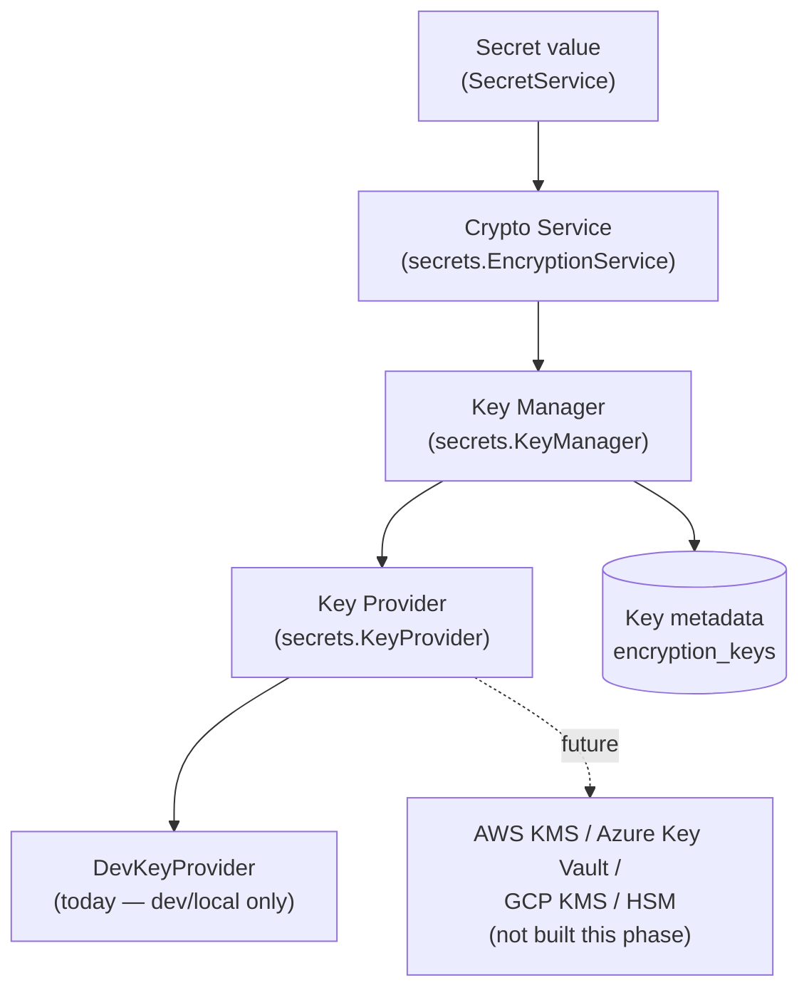
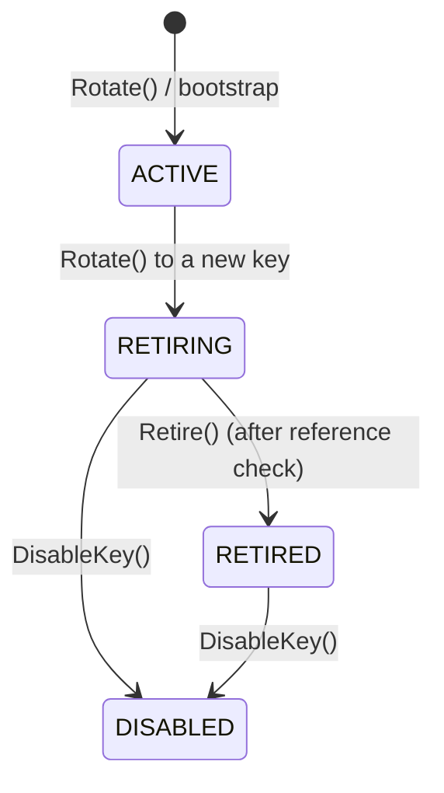

# Secrets Management Platform — Key Management Architecture (Sprint 4 Task 1)

**Status:** Foundation implemented, not production-ready. This document describes what exists today (`internal/secrets.KeyManager`, `internal/service.KeyRotationService`, `encryption_keys`), what a production deployment still needs (a real KMS/HSM-backed `KeyProvider`, an operator-facing rotation surface, mass re-encryption tooling), and the operational procedures that follow from the design. It does not claim the system described here is safe to run in production as-is — see [§7 Production readiness gap](#7-production-readiness-gap).

---

## 1. Architecture



- **Crypto Service** (`secrets.EncryptionService`, Sprint 3 Phase 2, unchanged this phase) — AES-256-GCM envelope encryption. Never persists anything, never talks to a database, never talks to a `KeyProvider` it didn't receive by constructor injection.
- **Key Manager** (`secrets.KeyManager`, new) — the layer this task adds. Owns *which* key is current, each key's lifecycle state, and the safety checks around rotation. Implements the exact same two-method `KeyProvider` interface `EncryptionService` already depended on, so `EncryptionService` itself required zero code changes — only what gets constructed in `cmd/server/main.go` changed.
- **Key Provider** (`secrets.KeyProvider`, existing interface, unchanged shape) — the seam to wherever raw key material actually lives. `DevKeyProvider` (existing) is the only implementation. Nothing above this interface — not `KeyManager`, not `EncryptionService`, not any service or handler — imports a cloud SDK or talks to a KMS directly.
- **Key metadata store** (`encryption_keys`, new table) — `KeyManager`'s own durable bookkeeping: which key identifiers exist and their lifecycle state. Never key material. Platform-wide, not per-organization (see the migration's own comment).

## 2. Key hierarchy

```
Key Encryption Key (KEK)
        |
Data Encryption Key (DEK)
        |
Secret ciphertext
```

- **KEK** — the key a `KeyProvider` hands back for a given `key_id`. Long-lived, rotated on the cadence this document describes, never itself stored anywhere (not in Postgres, not on disk in plaintext outside the provider). Encrypts DEKs, never secret values directly.
- **DEK** — generated fresh, in memory, for every single `Encrypt` call (`internal/secrets/encryption.go`). Wraps (AES-256-GCM-seals) the secret value, is itself wrapped under the current KEK, and is discarded the moment the operation returns — it is never reused across two secret versions, even two versions of the same secret.
- **Key identifier (`key_id`)** — an opaque string (`key-v1`, `key-v2`, ...) stored per `secret_versions` row. Metadata only; contains no key material and reveals nothing about it. It is the *only* thing that determines which KEK a `Decrypt` call uses — see [§4](#4-decryption-never-guesses).
- **Key version** — `secret_versions.key_version` (nullable, present since migration 000024, unused until now) is reserved for a KMS's *own* internal versioning of the material behind one `key_id` (relevant once a real KMS with auto-rotating key material is in the provider chain — see [§7](#7-production-readiness-gap)). This foundation does not populate it: `KeyManager`'s rotation always mints a new `key_id` (`key-v1` → `key-v2`), never an in-place version bump of an existing one.

Envelope encryption itself (KEK/DEK split, per-operation DEK, wrapped-DEK storage) already existed before this task (Sprint 3 Phase 2) — this task did not need to introduce it. What this task adds is everything above the KEK: which KEK is current, its lifecycle, and safe rotation between KEKs.

## 3. Key lifecycle



| State | Encrypt new data | Decrypt existing data |
|---|---|---|
| `ACTIVE` | Yes (the only state that can) | Yes |
| `RETIRING` | No | Yes |
| `RETIRED` | No | Yes, by default in this foundation (see below) |
| `DISABLED` | No | No |

`RETIRED` still permitting decrypt is a deliberate default, not an oversight: "retired" here means an operator has confirmed (via `KeyRotationService.RetireKey`'s real query against `secret_versions`) that no *current* secret version references the key — not that the key is cryptographically compromised. Treating a possibly-mistaken belief as an outright outage is worse than continuing to allow decrypt a little longer. `DISABLED` is the actual "stop, unconditionally" state, reserved for emergency revocation (see [§5](#5-emergency-key-revocation)). There is no code path back out of `DISABLED` — re-enabling a disabled key is a manual, reviewed operation, not an API call (see that method's own doc comment in `key_manager.go`).

Safeguards enforced in code, not just convention:
- `ActivateNewKey` (rotation) and the currently-active key's transition to `RETIRING` happen in one Postgres transaction — no partial rotation is observable.
- `Rotate` verifies the new key is actually retrievable from the `KeyProvider` *before* changing any state.
- `DisableKey` / `Retire` both refuse (`ErrKeyStillActive`) if asked to act on the currently active key — a key must be rotated away from before it can be wound down.
- A partial unique index (`uq_encryption_keys_one_active`) makes "more than one ACTIVE key" a database-level impossibility, not just an application invariant.
- `Rotate` refuses to reuse a `key_id` that has ever existed before (`ErrKeyAlreadyExists`) — forward-only, never resurrects a retired/disabled key implicitly.

## 4. Decryption never guesses

`EncryptionService.Decrypt` takes the `key_id` stored on the `secret_versions` row and asks `KeyManager.GetKey(ctx, key_id)` for exactly that key — never `GetCurrentKey`, never a fallback, never a "try the current key, then the previous one" loop. `KeyManager.GetKey` itself:
1. Looks up `key_id` in `encryption_keys`. Unknown → fails closed (`ErrKeyNotFound`), without ever asking the underlying provider — a `key_id` that never went through this manager's own registration is refused even if the provider happens to recognize it.
2. If the key is `DISABLED` → fails closed (`ErrKeyDisabled`), again without consulting the provider.
3. Otherwise, delegates to the provider for the actual bytes.

Combined with AES-GCM's own authentication (a ciphertext sealed under one key fails to authenticate under any other, by construction), this makes "decrypted with the wrong key" and "silently fell back to a different key" both structurally impossible, not merely untested.

## 5. Emergency key revocation

1. Confirm the active key is not the one being revoked; if it is, rotate to a new key first (`KeyRotationService.RotateKey`) so new writes stop using the compromised key immediately.
2. Call `KeyRotationService.DisableKey(ctx, actorUserID, keyID, reason, ipAddress)`. This is unconditional — unlike `RetireKey`, it does **not** wait for a "no longer referenced" check, because the entire point of revocation is to stop trusting the key even for existing data.
3. Every `secret_versions` row still carrying that `key_id` becomes unreadable the moment this returns — `GetKey` refuses before ever touching the provider. This is a real, immediate loss of read access to that data, accepted deliberately in exchange for cutting off a compromised key; see [§6](#6-backup-and-disaster-recovery-implications).
4. The `key.disabled` audit event records who, when, and the operator-supplied `reason` string — never key material.
5. Recovery from a disabled key that turns out *not* to have been compromised is a manual, reviewed database operation today (there is no "enable" API — see [§3](#3-key-lifecycle)). A future phase should decide whether that gap is acceptable or needs a deliberate, heavily-audited re-enable path.

## 6. Backup and disaster recovery implications

- **`encryption_keys` and `secret_versions` must be backed up together, on the same cadence, from the same consistent snapshot.** A restore that brings back `secret_versions` rows referencing a `key_id` `encryption_keys` no longer has a row for (or, worse, one whose state was rolled back to `ACTIVE` after a later rotation) is exactly the "never guess incorrectly" failure this design exists to avoid. `KeyManager.Bootstrap`'s refusal to silently mint a new key when the store has *some* rows but none `ACTIVE` (see `bootstrapFromProvider`'s doc comment) is the one built-in guard against this — it turns a restore inconsistency into a loud startup failure, not a silent wrong-key decrypt.
- **The `KeyProvider`'s own key material is the actual disaster-recovery-critical asset**, and today it is *not* covered by this document's backup story in any real sense: `DevKeyProvider` sources its one key from `AUTH_SECRETS_DEV_MASTER_KEY`, an environment variable with no backup mechanism of its own beyond whatever secrets manager injects it. Losing that value loses every secret ever encrypted under it, permanently — `encryption_keys` metadata alone (key IDs, states, timestamps) is useless for recovery without the key material a real `KeyProvider` implementation is responsible for. This is the single biggest reason this foundation is not production-ready — see [§7](#7-production-readiness-gap).
- **`InMemoryKeyMetadataStore` must never be used in any deployment that performs real rotation** (see its own doc comment) — a process restart loses rotation history and re-bootstraps from whatever the provider currently reports as current, which is correct only for a never-rotated single-key deployment.

## 7. Production readiness gap

This foundation is explicitly **not** production-ready as shipped. What's missing, in priority order:

1. **A real KMS/HSM-backed `KeyProvider`.** `DevKeyProvider` is explicitly development-only (see its own doc comment, unchanged from Sprint 3 Phase 2) — a single static key from an environment variable, no hardware isolation, no independent access audit trail, no managed backup. `KeyProvider`'s interface (`GetCurrentKey`, `GetKey`) is designed so a `secrets/awskms`, `secrets/azurekeyvault`, `secrets/gcpkms`, or `secrets/pkcs11` package can implement it without any change above this interface — this is deliberately not built yet (out of this task's explicit scope).
2. **An operator-facing surface for rotation.** `KeyRotationService` exists and is fully tested, but nothing calls `RotateKey`/`RetireKey`/`DisableKey` except tests and `main.go`'s one-time `EnsureBootstrapped` call at startup. Production needs an authenticated, RBAC-gated admin API or CLI in front of these methods, with its own permission grants (e.g. `keys:rotate`, `keys:manage`) — not built this phase.
3. **A rotation cadence/policy.** Nothing in this codebase schedules rotation. NIST SP 800-57 and most compliance frameworks (SOC 2, PCI-DSS) expect a documented maximum KEK age; enforcing or even reminding about that is future work.
4. **Mass re-encryption tooling** for retiring a key still referenced by old `secret_versions` rows (re-encrypting them under the current key so the old key can actually be retired) — explicitly out of scope for this task, and genuinely nontrivial: it needs to decrypt-then-re-encrypt every affected row without ever holding more plaintext in memory or on disk than one row's worth at a time, and must itself be auditable and resumable.
5. **KMS-backed key material backup/recovery** — see [§6](#6-backup-and-disaster-recovery-implications). A real KMS (AWS KMS, etc.) handles this natively; `DevKeyProvider` does not, by design.
6. **Multi-region / multi-provider considerations** if the platform ever runs in more than one region — out of scope for a single-process, single-database foundation.

## 8. Operational responsibilities (once a real KMS is in place)

- **Platform/security team:** owns the KMS account/project, key policies, and who may call `RotateKey`/`DisableKey` once an admin surface exists. Owns the rotation cadence decision.
- **On-call:** owns executing `DisableKey` during a suspected compromise (see [§5](#5-emergency-key-revocation)) and knowing that it is irreversible via this codebase's own API.
- **Database/infra team:** owns ensuring `encryption_keys` and `secret_versions` backups stay consistent with each other (see [§6](#6-backup-and-disaster-recovery-implications)) and, separately, that the KMS's own backup/multi-region replication (once adopted) meets the platform's RPO/RTO targets.
- **Whoever runs `RetireKey`:** is trusting `CountVersionsByKeyID`'s query against the live `secret_versions` table — a check performed at the moment of the call, not a standing guarantee. A version created under the old key by a concurrent write between the check and the retirement is a real, if narrow, race this foundation does not close (`RetireKey`'s check-then-act is not run inside the same transaction as `Retire`'s state update). Production hardening should either narrow that window or accept it explicitly as policy — not built this phase.
